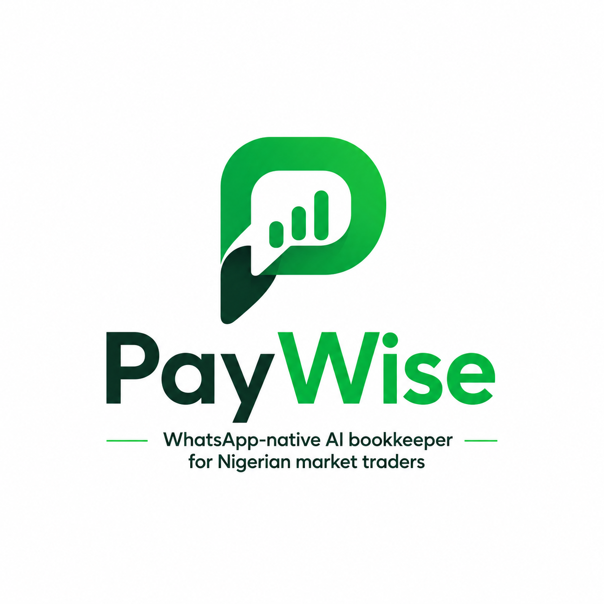

<p align="center">
  
</p>

<h1 align="center">PayWise</h1>
<p align="center">
  <em>Your AI Bookkeeper on WhatsApp — Built for Nigerian Market Traders</em>
</p>

<p align="center">
  
  
  
  
  
  
  
</p>

---

## 📌 The Problem

**Millions of Nigerian market traders lose money every day because they track credit sales on paper or in their head.**

- A trader sells goods on credit to Alhaji, Mama Ngozi, and 20 other regulars
- They scribble "Alhaji — ₦5,000" in a notebook
- The notebook gets wet, lost, or the page rips
- Come collection day, they can't remember who owes what
- They lose thousands of naira — money their family depends on

Existing solutions (QuickBooks, Wave, Excel) assume you have a laptop, speak English, and understand accounting. Most Nigerian market traders don't. **They have a WhatsApp phone.**

---

## 💡 The Solution

**PayWise is an AI bookkeeper that lives inside WhatsApp.** Traders talk to it in Pidgin, Yoruba, Hausa, or Igbo — just like they'd talk to a human assistant.

### How it works:

```
👩🏾 Trader sends a voice note: "Alhaji Musa just buy 3 bags of rice for ₦45,000. He go pay next week."
       │
       ▼
🤖 PayWise (AI Agent) understands the voice note, extracts the details
       │
       ▼
📒 Records it in the digital ledger: debtor, amount, goods, due date
       │
       ▼
🏦 Creates a temporary Nomba virtual account for the debtor
       │
       ▼
💬 Sends a WhatsApp message to Alhaji Musa with payment instructions
       │
       ▼
💰 When Alhaji pays, Nomba webhook fires → ledger updates → wallet credits
       │
       ▼
📊 Merchant checks: "Who dey owe me?" → PayWise reads totals out loud
```

---

## 🏗️ Architecture

```
┌──────────────────────────────────────────────────────────┐
│                    WhatsApp (Twilio)                     │
│  Voice notes & text from market traders                  │
└──────────┬───────────────────────────────┬───────────────┘
           │                               │
           ▼                               ▼
┌──────────────────┐             ┌──────────────────┐
│  Speech-to-Text  │             │  Text-to-Speech  │
│  (ElevenLabs)    │             │  (Gemini 3.1)    │
│  Yoruba/Hausa/   │             │  5 personas:     │
│   Igbo/Pidgin    │             │  Iya Gbemi, Mama │
│                  │             │  Ngozi, Hajia    │
│                  │             │  Aisha, Aunty    │
│                  │             │  Bose, Funke     │
└────────┬─────────┘             └────────┬─────────┘
         │                                │
         ▼                                ▼
┌──────────────────────────────────────────────────────────┐
│                 LangGraph AI Agent                       │
│  Powered by GPT-5 with 25+ tools for:                    │
│  • Recording debts    • Managing debtors                 │
│  • Creating VAs       • Tracking payments                │
│  • Editing/deleting   • Wallet management                │
│  • Reminders          • Multi-language support           │
└──────────┬───────────────────────────────┬───────────────┘
           │                               │
           ▼                               ▼
┌──────────────────┐             ┌──────────────────┐
│    MongoDB       │             │   Nomba API      │
│  • Merchants     │             │  • Virtual Accts │
│  • Debtors       │             │  • Bank Transfers│
│  • Debts         │             │  • Webhooks      │
│  • Transactions  │             │  • KYC           │
│  • Wallets       │             │                  │
└──────────────────┘             └──────────────────┘
           │
           ▼
┌──────────────────────────────────────────────────────────┐
│                  Wallet Dashboard                        │
│  Web UI at /wallet — merchant logs in, views balance,    │
│  downloads statement, withdraws to bank account          │
└──────────────────────────────────────────────────────────┘
```

---

## ✨ Features

### 🤖 AI-Powered WhatsApp Bookkeeper
- **Voice note input** — Speak in Yoruba, Hausa, Igbo, or Pidgin. PayWise understands you.
- **Voice note replies** — Get responses back in your language as audio, not text walls.
- **Conversational interface** — No menus, no forms. Just talk like you'd talk to a person.

### 📒 Smart Ledger Management
- **Record credit sales** — "Mama Bose buy 5 wrappers for ₦15,000"
- **Auto-draft saving** — If you forget the phone number, the sale is saved as a draft. Never lose a record.
- **Edit & delete** — "Change Alhaji amount to ₦7,000" or "Cancel that debt"
- **Track running balances** — "How much Alhaji dey owe me total?"

### 🏦 Collection Accounts (Nomba Virtual Accounts)
- **One account per debtor** — Each debtor gets a temporary bank account number for payment
- **Auto-expiry** — Accounts expire after the due date + grace period
- **Real-time settlement** — When a debtor pays, the webhook fires instantly
- **WhatsApp receipts** — Both debtor and merchant get payment confirmations

### 💰 Wallet & Withdrawals
- **Live balance** — See your total earnings in real-time
- **Transaction history** — Every payment recorded with dates and references
- **Manual withdrawal** — Merchant logs into wallet dashboard to withdraw to bank (AI can't touch money — security by design)
- **Statement download** — Export your transaction history

### 🗣️ Multi-Language Voice Personas
| Language | Persona | Voice Style |
|----------|---------|-------------|
| Pidgin | Aunty Bose (Warri) | Warm, relaxed, musical |
| Yoruba | Iya Gbemi (Ibadan) | Maternal, dignified, proper tones |
| Igbo | Mama Ngozi (Onitsha) | Confident, sharp, trader energy |
| Hausa | Hajia Aisha (Kano) | Calm, measured, respectful |
| English | Funke (Lagos) | Professional, friendly, Nigerian radio style |

---

## 🚀 Quick Start

### Prerequisites
- Python 3.11+
- MongoDB (Atlas free tier works)
- Twilio WhatsApp Sandbox account
- Nomba API keys (sandbox or live)
- OpenAI API key
- ElevenLabs API key (for STT)
- Gemini API key (for TTS)

### Installation

```bash
# Clone the repo
git clone https://github.com/YOUR_USERNAME/paywise.git
cd paywise

# Create virtual environment
python -m venv venv
source venv/bin/activate  # or venv\Scripts\activate on Windows

# Install dependencies
pip install -r requirements.txt

# Copy and fill in environment variables
cp .env.example .env
# Edit .env with your actual API keys
```

### Environment Variables

See `.env.example` for the full list. Key variables:

| Variable | Description |
|----------|-------------|
| `MONGODB_URI` | MongoDB connection string |
| `OPENAI_API_KEY` | OpenAI API key (GPT-5) |
| `ELEVENLABS_API_KEY` | ElevenLabs for speech-to-text |
| `GEMINI_API_KEY` | Gemini for text-to-speech |
| `TWILIO_ACCOUNT_SID` | Twilio account SID |
| `TWILIO_AUTH_TOKEN` | Twilio auth token |
| `NOMBA_CLIENT_ID` | Nomba API client ID |
| `NOMBA_CLIENT_KEY` | Nomba API client secret |
| `NOMBA_ACCOUNT_ID` | Nomba parent account ID |
| `NOMBA_SUB_ACCOUNT_ID` | Nomba sub-account ID |

### Running Locally

```bash
uvicorn app.main:app --reload --host 0.0.0.0 --port 8000
```

For WhatsApp, you'll need ngrok to expose your local server:

```bash
ngrok http 8000
```

Then set your Twilio WhatsApp webhook URL to your ngrok URL + `/webhooks/whatsapp`.

### Deploying to Production

See [Deployment Guide](#) — Railway ($5/month, never sleeps) or Render (free tier, sleeps after 15min).

```bash
# Railway deploys automatically from GitHub
# Just set your env vars in the Railway dashboard and push

# Or use Docker
docker build -t paywise .
docker run -p 8000:8000 --env-file .env paywise
```

---

## 📁 Project Structure

```
paywise/
├── app/
│   ├── main.py                 # FastAPI entry point, routes, lifespan
│   ├── config.py               # Settings from .env
│   ├── db.py                   # MongoDB connection + indexes
│   ├── models.py               # Pydantic data models
│   ├── utils.py                # Helpers (naira conversion, date parsing)
│   ├── agent/
│   │   ├── graph.py            # LangGraph state machine (nodes + routing)
│   │   ├── prompt.py           # System prompt with persona + rules
│   │   ├── tools_read.py       # Agent read tools (list debts, find debtors)
│   │   └── tools_write.py      # Agent write tools (record, edit, delete)
│   ├── api/
│   │   ├── whatsapp_webhook.py # Twilio WhatsApp inbound handler
│   │   ├── nomba_webhook.py    # Nomba payment settlement webhook
│   │   └── wallet.py           # Wallet dashboard API
│   ├── services/
│   │   ├── nomba.py            # Nomba API client (VA, transfer, KYC)
│   │   ├── tts.py              # Gemini TTS with language personas
│   │   └── whatsapp.py         # Twilio WhatsApp sender
│   └── templates/
│       ├── landing.html        # Public landing page
│       ├── paywise-logo.png    # Logo
│       └── wallet/             # Wallet dashboard templates
├── Procfile                    # Deployment (Railway/Render)
├── Dockerfile                  # Container build
├── requirements.txt            # Python dependencies
└── .env.example                # Environment variables template
```

---

## 🔒 Security

- **AI cannot withdraw money** — Withdrawals only through the wallet dashboard with password auth. The agent has no transfer tools.
- **Webhook signature verification** — Nomba payments are cryptographically verified before settling
- **Idempotency** — Duplicate webhooks are rejected (Mongo transaction check)
- **Amount validation** — Over-payments and duplicate payments are rejected
- **Password-protected wallet** — Merchant dashboard requires login

---

## 🧪 Testing

```bash
# Test the full demo flow:
python reset_demo.py          # Wipe and re-seed demo data
# Then message the WhatsApp bot: "I be Ijioma Ikanda"
# Record a debt, create a collection account
python sim_pay.py             # Simulate a debtor payment via webhook
# Check the wallet dashboard at /wallet
```

---

## 🏆 Built for DevCareer x Nomba Hackathon 2026

PayWise was built by **Ajala Abdullah** for the DevCareer x Nomba Hackathon, addressing the challenge of financial inclusion for Nigeria's informal market traders.

- **Track:** Full-Stack / Fintech
- **Key Innovation:** WhatsApp-native interface with multi-language AI voice notes
- **Nomba Integration:** Virtual accounts, webhooks, bank transfers

---

## 📄 License

MIT — see LICENSE file.

---

<p align="center">
  <strong>PayWise</strong> — Your market. Your money. Your language. 🤝
</p>
